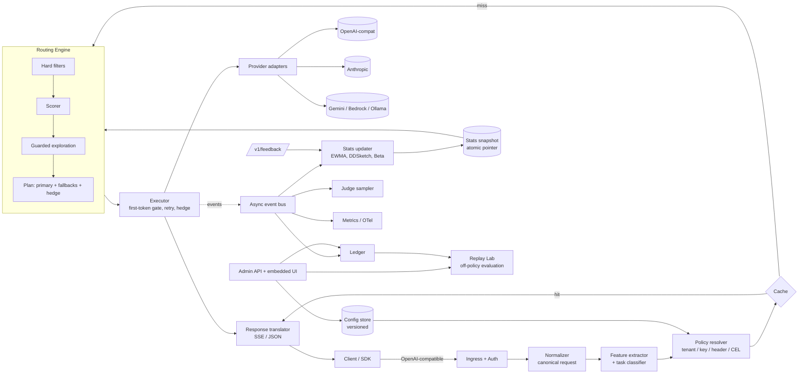

# Conduit — System Design

> **Conduit** is a single-binary Go microservice that sits between your application and any number of LLM providers. You tell it *what you want* (cheap, fast, best, or a custom SLO) instead of *which model to call*. It picks the model per request, learns from outcomes, fails over safely, and can explain and replay every decision.

Status: design v1.0 · Language: Go 1.23+ · License target: Apache-2.0

---

## 0. TL;DR

| Question | Answer |
|---|---|
| What is it? | An OpenAI-compatible AI API gateway with a *learning* routing brain. |
| What is novel? | (1) Intent-based routing with hard constraints + utility scoring, (2) closed-loop quality learning with *safe, logged exploration*, (3) streaming-aware reliability (first-token gating, hedging), (4) a **Decision Ledger + Replay Lab** that evaluates new routing policies offline on real traffic using off-policy estimators, (5) three adoption modes: full proxy, Go library, decision-only sidecar. |
| How do I use it? | Point any OpenAI SDK at Conduit's `base_url`, set `model: "auto"` (or `auto:cheap`, `auto:fast`, `auto:best`, `policy:<name>`). |
| How is it deployed? | One static binary or one distroless container. SQLite by default; Postgres/Redis optional for clusters. UI is embedded in the binary. |
| How is it verified? | Built-in mock provider + k6 suites for overhead, routing accuracy, chaos/failover, cost-vs-quality, and soak. |

---

## 1. Problem framing

**Given** N models across M providers, each with different price, latency, context window, capabilities, rate limits, and availability, **decide per request** which model to call so that the caller's objective is met, and keep working when providers degrade.

### 1.1 Functional requirements

- F1. OpenAI-compatible ingress (`/v1/chat/completions`, `/v1/embeddings`, `/v1/models`), streaming (SSE) and non-streaming. Anthropic-style ingress (`/v1/messages`) as phase-2.
- F2. Provider adapters: OpenAI-compatible (covers OpenAI, Azure OpenAI, vLLM, Ollama, LM Studio, Together, Groq, etc.), Anthropic, Gemini, Bedrock (later).
- F3. Routing on **latency, cost, context length, availability, task type** (the five axes of the problem statement) plus capabilities (tools, vision, JSON mode), data-residency tags, and quality.
- F4. Failover, retries, hedging, circuit breaking, provider rate-limit awareness.
- F5. Virtual API keys, per-key/team budgets, quotas.
- F6. Full decision explainability and replay.
- F7. Declarative config (YAML) + runtime admin API + web UI, hot reload, no restarts.
- F8. Observability: Prometheus, OpenTelemetry traces, structured logs.

### 1.2 Non-functional requirements

| Attribute | Target (verify with the k6 harness, do not trust this table blindly) |
|---|---|
| Gateway overhead (excl. upstream) | p50 < 1 ms, p99 < 5 ms at 2 000 rps on 4 vCPU, non-streaming |
| Routing decision time | < 200 µs for ≤ 50 candidate models |
| Extra TTFT for streams | < 2 ms p99 |
| Availability | Survives loss of any single provider with < 0.5% failed requests |
| Memory | < 150 MB RSS idle, < 500 MB at 5 000 concurrent streams |
| Startup | < 1 s, zero external dependencies required |
| Safety | *Never* route to a model that violates a hard constraint (context, capability, residency, allow-list). |

### 1.3 Non-goals (v1)

Prompt management, guardrails/content moderation, agent orchestration, fine-tuning, MCP tool proxying. Conduit exposes hooks for these but does not own them.

---

## 2. Landscape and the gap Conduit fills

Research summary (open-source and managed gateways as of mid-2026):

| Gateway | Strength | Limitation relevant here |
|---|---|---|
| LiteLLM | Widest provider coverage, fast path to a working proxy | Python runtime; slows under heavy concurrency; Postgres commonly in the hot path for spend tracking |
| Portkey (OSS core, MIT) | Fallbacks, retries, guardrails, governance | Routing is rule/fallback based |
| Envoy AI Gateway | Kubernetes-native, Apache-2.0, built on Envoy | Requires K8s/Envoy expertise; routing is policy-driven, not learned |
| Bifrost (Go) | Low overhead, single binary, virtual keys and budgets | Vendor benchmark claims and independent runs disagree; thin dashboards |
| OpenRouter / Vercel AI Gateway | Zero-ops managed access | Not self-hostable; you don't control the routing logic |

**Common gap.** Almost all of them treat routing as *static configuration*: fallback lists, weights, round-robin, load-balancing. They rarely (a) measure whether the routed model actually produced a *good* answer for that *kind* of task, (b) let you test a new routing policy without spending money on live traffic, or (c) explain why a specific request went where it went.

**Positioning.** Conduit is a *routing brain that also happens to be a gateway*. You can:

1. **Run it as the full proxy** (simplest).
2. **Import `pkg/router` as a Go library** inside your own service.
3. **Call `POST /v1/route` as a decision-only sidecar** and keep your existing proxy (LiteLLM, Envoy, Kong, a custom one) for transport.

Mode 3 is the adoption wedge: teams don't have to rip out their current gateway.

---

## 3. Design principles

1. **Constraints before preferences.** Hard filters are exact and cheap; scoring only ever sees feasible candidates.
2. **Deterministic hot path, learning off-path.** The request path reads an immutable snapshot of statistics; background workers update them.
3. **Every decision is logged with its propensity.** That single rule enables offline evaluation later.
4. **Safe exploration.** Exploration is bounded by a utility guard so it can't send traffic to obviously bad models.
5. **Never block on non-essentials.** Ledger, metrics, judge, cache-write failures must not fail or slow requests.
6. **Zero-dependency by default; scale by opt-in.** SQLite + in-memory to start; Redis/Postgres to scale.
7. **Explain everything.** Any response can be traced to a decision ID with the full candidate table.

---

## 4. Architecture



### 4.1 Components

| Component | Responsibility | Package |
|---|---|---|
| Ingress | HTTP server, auth (virtual keys), body limits, request IDs | `internal/server` |
| Normalizer | Parse OpenAI/Anthropic requests into a canonical struct with lazy JSON (no full re-marshal on pass-through) | `internal/canonical` |
| Feature extractor + classifier | Token estimate, capability flags, task class + confidence | `internal/classify` |
| Policy resolver | Choose policy from key, header, model alias, CEL rules | `internal/policy` |
| Catalog | Models, prices, context windows, capabilities, priors | `internal/catalog` |
| Routing engine | Filter → score → explore → plan | `internal/router` (`pkg/router` re-exports) |
| Stats | EWMA latency/TPS, DDSketch quantiles, Wilson error bounds, Beta quality posteriors | `internal/stats` |
| Health | Circuit breakers, outlier ejection, rate-limit governor | `internal/health` |
| Executor | First-token gating, retries, hedging, streaming translation | `internal/exec` |
| Adapters | Provider-specific request/response/stream mapping | `internal/provider/*` |
| Budget | Hierarchical spend limits, reservations | `internal/budget` |
| Cache | Exact-match cache, semantic cache plug-in interface | `internal/cache` |
| Ledger | Append-only decision store | `internal/ledger` |
| Learning | Reward computation, judge sampler, feedback intake | `internal/learn` |
| Replay Lab | IPS / SNIPS / doubly-robust estimators, policy simulation | `internal/replay` |
| Admin | REST API, SSE live feed, embedded UI | `internal/admin`, `ui/` |
| Telemetry | Prometheus, OTel, slog | `internal/telemetry` |

### 4.2 Process modes

One binary, three modes selected by `server.mode`:

- `all` (default): data plane + control plane in one process.
- `data`: only the request path. Reads config and shared state from control plane / stores.
- `control`: admin API, UI, ledger queries, replay, config.

This lets a small user run one process while a larger deployment scales the data plane horizontally.

---

## 5. Request lifecycle

1. **Accept.** Assign `request_id`; enforce body size and header limits.
2. **Authenticate.** Virtual key → tenant, budget scope, default policy. Constant-time compare on key hash.
3. **Normalize.** Extract only what routing needs (model, messages, tools, `response_format`, `stream`, `max_tokens`, `metadata`) using a streaming JSON scanner; keep the raw body for pass-through.
4. **Featurize.** Estimate input tokens (fast tokenizer approximation, ±10%); detect vision, tools, JSON mode; classify task.
5. **Resolve policy.** Precedence: explicit `model: policy:<name>` > `x-conduit-policy` header > CEL rule match > key default > global default. `model: auto:<objective>` overrides only the objective.
6. **Budget check.** Reserve estimated cost; on soft limit apply the policy's downgrade behavior; on hard limit return `429 budget_exceeded`.
7. **Cache lookup.** Exact-match (deterministic requests only by default).
8. **Route.** Hard filters → score → guarded exploration → build plan (primary, ordered fallbacks, hedge delay). Log candidates and propensity to the ledger buffer.
9. **Execute.** Try primary with a **first-token gate**: no bytes reach the client until the upstream produces its first chunk (or completes, if non-streaming). Failover/hedge before that gate is safe and invisible.
10. **Translate & stream.** Convert upstream chunks to the ingress format; flush per event.
11. **Finish.** Reconcile budget with actual usage; emit event to the bus (stats, ledger, metrics, judge sampler); write cache.
12. **Feedback (optional, later).** Caller posts `/v1/feedback` with `decision_id` and a reward; the learner updates posteriors.

Response headers on every call:

```
x-conduit-request-id, x-conduit-decision-id, x-conduit-policy, x-conduit-task,
x-conduit-model, x-conduit-provider, x-conduit-attempts, x-conduit-cache,
x-conduit-cost-usd, x-conduit-overhead-us
```

---

## 6. The routing engine (the core idea)

Routing is a four-stage pipeline. Each stage is an interface so users can replace it.

```
Candidates(all models) → HardFilter → Estimate → Score → GuardedSelect → Plan
```

### 6.1 Stage 1 — Hard filters (exact, never violated)

A model is **rejected with a recorded reason** if any of these fail:

| Filter | Rule |
|---|---|
| Context fit | `in_tokens × 1.10 + reserved_output ≤ context_tokens` (safety margin covers tokenizer error) |
| Capability | Requires tools / vision / JSON mode / streaming ⇒ model must declare it |
| Availability | Circuit breaker not `Open`; provider key pool not fully rate-limited |
| Allow/deny | Policy `allow_models` / `deny_models` globs, tenant restrictions |
| Residency | Policy `regions` ∩ model `regions` ≠ ∅ |
| Budget | Estimated cost ≤ remaining budget and ≤ `constraints.max_cost_usd` |
| Explicit SLOs | Estimated latency ≤ `constraints.max_latency_ms`; estimated quality ≥ `constraints.min_quality` |

**Relaxation.** If no candidate survives, the policy's `on_infeasible` decides: `relax` (drop SLO filters in the order latency → cost → quality and flag the response `x-conduit-relaxed: latency`) or `reject` (`422 no_feasible_model` with per-model reasons). Hard capability/context filters are **never** relaxed.

### 6.2 Stage 2 — Estimates (per candidate, per request)

| Symbol | Meaning | Estimator |
|---|---|---|
| `Q̂` | Expected quality in [0,1] for this *task class* | Beta posterior `Beta(α, β)` per (task, model); `Q̂ = mean + κ·sd` (κ decays from 1.0 → 0.2 as evidence accumulates) |
| `Ĉ` | Expected USD | `in_tok·p_in + E[out]·p_out`, where `E[out] = min(max_tokens, task_p50_out)` learned from the ledger |
| `L̂` | Expected total latency (ms) | `TTFT_q + E[out] / TPS_q` from DDSketch quantile `q` (p50 default, p90 when policy is latency-sensitive). Shrunk toward a configured prior by `n/(n+k)` while samples are few |
| `R̂` | Risk in [0,1] | `1 − (1 − errUB)·headroom`; `errUB` = Wilson upper bound of the recent error rate; `headroom` = min(1, remaining provider token budget / needed) from the rate-limit governor |

**Cold start.** Each model declares `priors` (per task class, from public leaderboards, your own evals, or a default) and `prior_strength` (pseudo-observations, e.g. 20). Posterior initialises as `α₀ = prior·s`, `β₀ = (1−prior)·s`. New models are therefore usable from request #1, and real evidence gradually dominates.

**Non-stationarity.** Counts decay with a configurable half-life (default 7 days) so provider quality/latency drift (silent model updates, regional slowdowns) is tracked.

### 6.3 Stage 3 — Utility score

Costs span orders of magnitude, so cost is normalised on a log scale; latency is min–max normalised. Both are computed *across the surviving candidates of this request*, so weights keep the same meaning regardless of absolute prices.

```
c'  = minmax( log(Ĉ + 1e-6) )         over survivors
l'  = minmax( L̂ )                     over survivors
U   = w_q·Q̂ − w_c·c' − w_l·l' − w_r·R̂
```

Objective presets (all overridable per policy):

| Objective | w_q | w_c | w_l | w_r |
|---|---|---|---|---|
| `best` | 0.80 | 0.02 | 0.08 | 0.10 |
| `balanced` | 0.50 | 0.20 | 0.20 | 0.10 |
| `fast` | 0.30 | 0.10 | 0.55 | 0.05 |
| `cheap` | 0.30 | 0.55 | 0.10 | 0.05 |

The Pareto frontier over (Q̂, Ĉ, L̂) is also computed and stored; the UI highlights frontier membership and "dominated" candidates, which makes routing choices easy to reason about.

### 6.4 Stage 4 — Guarded exploration with exact propensities

Pure greedy routing never learns about models it doesn't pick. Naïve exploration wastes money and hurts users. Conduit uses a **guarded-softmax + ε-uniform mixture** whose probabilities are *exactly computable*, so the logged propensity is exact:

```
G      = { a ∈ feasible : U_best − U_a ≤ δ }                     # guard set
p_g(a) = exp((U_a − U_best)/τ) / Σ_{b∈G} exp((U_b − U_best)/τ)   # for a ∈ G, else 0
p(a)   = (1 − ε)·p_g(a) + ε / |feasible|                         # full support
```

- `δ` (guard) bounds how much worse an explored model can be in utility — safe exploration.
- `τ` (temperature) controls concentration inside the guard set.
- `ε` (default 0.02) guarantees every feasible model has non-zero probability — required for unbiased off-policy evaluation.
- Sampling uses a PRNG seeded by `hash(decision_id)`, so any decision can be reproduced exactly.
- Exploration is disabled per policy (`exploration.enabled: false`) or per request (`x-conduit-explore: off`) for regulated workloads.
- An explicit `auto:<objective>` intent scales exploration: `best` narrows the guard (`δ × 0.25`, `ε` halved) so "give me the best" doesn't experiment on the caller; other objectives keep the policy's configured values.

*Why not Thompson sampling?* It's excellent for learning, but the propensity of the chosen arm has no closed form (needs Monte-Carlo estimates), which weakens the Replay Lab. The optimism term `κ·sd` in `Q̂` gives Thompson-like directed exploration while keeping propensities exact.

### 6.5 Plan output

The router returns a `Plan`, not just a model:

```go
type Plan struct {
    DecisionID  string
    Attempts    []Attempt      // primary + provider-diverse fallbacks, ordered by U
    HedgeDelay  time.Duration  // 0 = no hedging
    Relaxed     []string
    Candidates  []CandidateTrace // everything, incl. rejected + reasons
    Propensity  float64
    Explored    bool
}
```

Fallbacks are ordered by utility and made **provider-diverse**: after a provider-wide failure (5xx storm, auth error, timeout on connect), other models of the same provider are skipped for that request.

### 6.6 Learning the reward (the hard part)

Quality is not directly observable. Conduit combines several weak signals into a reward `r ∈ [0,1]`, each optional and configurable per route:

| Signal | Source | Default weight |
|---|---|---|
| Explicit feedback | `POST /v1/feedback` (thumbs, score 0–1) | 1.0 (dominates if present) |
| Validators | JSON-schema validity, regex, tool-call argument validity, "finish_reason ≠ length" | 0.5 |
| Implicit behavior | Caller re-asks / regenerates within N seconds (`x-conduit-regenerate-of: <decision_id>`) | 0.3 |
| LLM-as-judge (sampled) | 1–5% of traffic scored asynchronously by a configured judge model with a task-specific rubric; judge cost is budgeted | 0.4 |
| Gold checks | Periodic canary prompts with known answers per task class | 0.6 |

Guards against reward hacking: the judge is never one of the candidate models for the item it scores (configurable), judge scores are calibrated against explicit feedback when available, and judged data is tagged so the UI can show signal source mix.

### 6.7 Learning update

On reward `r` for (task `t`, model `m`): `α ← γ·α + r`, `β ← γ·β + (1 − r)` with lazy time-decay `γ`. The counts are **additive**, so posteriors from multiple gateway nodes merge by summing counts (a grow-only-counter style CRDT) — this is what makes multi-node deployment simple (§17).

---

## 7. Task classification

The task class is a routing feature, so it must be **fast, local, and good enough**. Three tiers, stopping at the first confident answer:

| Tier | Method | Budget | Notes |
|---|---|---|---|
| 0. Explicit | `metadata.task` or `x-conduit-task` header | ~0 | Trusted, skips inference |
| 1. Rules | Regex + structural features: code fences, `def`/`func`/`SELECT`, math tokens, JSON-schema present, tools array, target-language phrases, system-prompt keywords, context-chunk markers ("Context:", `<document>`), length | < 30 µs | High precision for obvious cases |
| 2. Linear model | Hashed n-gram + structural features → multinomial logistic regression; weights shipped as a small JSON/binary embedded via `go:embed`; trained by `cmd/conduit-train` from ledger/labeled data | < 100 µs | Returns class + calibrated confidence |
| 3. Plug-in (optional) | HTTP/gRPC hook to an external classifier (e.g., embedding router) with a hard 5 ms timeout; falls back to tier 2 | ≤ 5 ms | For teams with their own router |

Default classes: `chat`, `code`, `reasoning_math`, `extraction_structured`, `summarization`, `translation`, `creative_writing`, `classification_short`, `rag_qa`, `tool_agent`. Users can add classes and priors in config. Classification never leaves the process by default, which is a privacy advantage over routers that call an external model.

Low-confidence results (< threshold) route as `chat` with a "generalist" prior, and the ledger stores the confidence so the UI can show misclassification hot-spots.

---

## 8. Reliability

### 8.1 Circuit breaking and outlier ejection (per model, per provider key)

- States: `Closed → Open → HalfOpen`.
- Open when *any*: consecutive failures ≥ N, rolling error rate ≥ X% over ≥ M requests, or latency ejection (p50 > k × baseline over window).
- Open duration uses exponential backoff with jitter; HalfOpen admits a small number of probes (real requests with hedge cover, or synthetic health probes).
- Provider-level breaker trips when ≥ 50% of that provider's models are Open.

### 8.2 Capacity governor (rate-limit aware)

- Per provider key: token buckets for RPM/TPM seeded from config and **corrected from response headers** (`x-ratelimit-remaining-requests/tokens`, `retry-after`).
- Multiple API keys per provider form a pool; requests are spread by remaining headroom.
- Headroom feeds `R̂` so routing *avoids* a saturated provider before receiving 429s (predictive rather than reactive).

### 8.3 Error taxonomy

| Class | Examples | Action |
|---|---|---|
| Retryable | 429, 5xx, overloaded, timeout, connection reset | Fail over to next attempt; feed breaker |
| Context/capability error | `context_length_exceeded` from a model we thought fit | Fail over to larger-context model; record estimator error |
| Auth | 401/403 | Quarantine that key; alert; fail over |
| Client error | 400 validation | Return as-is (do not retry; not the provider's fault) |
| Refusal/content policy | `finish_reason: content_filter` | Return as-is unless `retry_on_refusal: true` |

### 8.4 Streaming semantics

| Phase | Behavior |
|---|---|
| Before first upstream chunk (headers to client not yet sent) | Full retry/failover and hedging; invisible to the client |
| After first token | Default `mid_stream: fail` — send an SSE error event and close cleanly, mark for reward penalty |
| After first token, opt-in | `mid_stream: resume` (experimental) — re-issue to a fallback with the partial assistant text as prefill/continuation. Disabled for tool-call streams |

The gateway defers writing response headers until the first upstream chunk arrives; this makes TTFB a faithful proxy of TTFT, which the k6 harness relies on.

### 8.5 Hedging

- Trigger: primary hasn't produced a first token by `hedge_delay = max(min_delay, TTFT p95 for (model, task))`.
- Only pre-first-token; only for policies with `hedging.enabled`.
- Hedge budget: token bucket capping hedged requests to e.g. 5% of traffic; loser cancelled through context; wasted spend is tracked as `conduit_hedge_waste_usd`.
- Winner is the first to produce a token; both outcomes update stats (a hedge that wins is evidence the primary is slow).

---

## 9. Cost and budget engine

- Price catalog per model: input/output per Mtok, optional cached-input and batch prices; updated from config or an optional community price feed (off by default).
- **Actual cost** from provider-reported usage; fallback to token estimates; cancelled hedges are charged input-only estimates.
- Budget hierarchy: org → team → virtual key; windows: day/month/rolling; currencies as USD.
- **Reserve–reconcile**: reserve `Ĉ` at admission, reconcile with actual on completion; prevents overshoot under concurrency.
- Soft limit → `on_soft_limit`: `downgrade` (re-weight toward `cheap` and cap `max_cost_usd`), `warn`, or `none`. Hard limit → `429 budget_exceeded` with reset time.
- Graceful degradation instead of outage is a product feature: "your bot gets cheaper, not dead".

---

## 10. Caching

- Exact-match cache key: `SHA256(canonical(messages, tools, response_format, sampling params, policy-class))`, partitioned by tenant.
- Default: only when `temperature == 0` or `x-conduit-cache: allow`.
- In-memory LRU (default) → optional Redis. TTL per policy.
- **Semantic cache** is an interface (`Embedder`, `VectorIndex`), off by default because it's a correctness risk. When on, similarity threshold and per-task allow-list are required.
- Cache hits are ledgered with `cost = 0` and counted as savings on the dashboard. Streaming hits replay as synthetic chunks.
- Cache never stores content when `content_logging: none` (uses hash-only negative caching disabled).

---

## 11. Configuration and policy model

### 11.1 Principles

- Declarative YAML, JSON-Schema-validated, versioned; changes via file (GitOps), admin API, or UI. Every change creates an immutable **config version** with author and diff.
- Hot reload with atomic swap. A bad config is rejected and the previous version keeps serving.
- `conduit validate` and `conduit simulate` (run policy against sample requests) work offline.

### 11.2 Policy shape

```yaml
policies:
  - name: support-bot
    match: 'request.metadata.app == "support" && request.task in ["rag_qa","chat"]'   # CEL
    objective: cheap
    weights: { quality: 0.35, cost: 0.5, latency: 0.10, risk: 0.05 }   # optional override
    constraints: { min_quality: 0.65, max_latency_ms: 6000, max_cost_usd: 0.02 }
    allow_models: ["*/haiku*", "*/mini*", "local/*"]
    regions: [eu, in]
    exploration: { enabled: true, epsilon: 0.02, delta: 0.08, tau: 0.05 }
    hedging: { enabled: true, min_delay_ms: 800, max_share: 0.05 }
    reliability: { max_attempts: 3, mid_stream: fail, retry_on_refusal: false }
    on_infeasible: relax
    on_soft_limit: downgrade
    reward:
      validators: [ { type: json_schema, ref: support_answer } ]
      judge: { sample: 0.03, model: judge/mini, rubric: rag_qa_v1 }
```

CEL is chosen over Rego/Lua/custom DSL because it is non-Turing-complete, fast, sandboxed, has a mature Go implementation (`cel-go`), and is already familiar to Kubernetes/Envoy users.

### 11.3 Virtual model names

| `model` value | Meaning |
|---|---|
| `auto` | Use key's default policy |
| `auto:cheap` / `auto:fast` / `auto:best` / `auto:balanced` | Default policy with objective override |
| `policy:<name>` | Explicit policy |
| `<provider>/<model>` | Pin to a model (still gets failover unless `x-conduit-pin: strict`) |

---

## 12. Data model and storage

| Data | Default store | Scale-out store | Notes |
|---|---|---|---|
| Config versions | SQLite | Postgres | Also loadable from YAML file |
| Virtual keys, budgets | SQLite | Postgres (+ Redis counters) | Keys stored as `sha256(HMAC(secret, key))` |
| Ledger | SQLite (WAL) | Postgres / export to Parquet/ClickHouse | Async batched writes; ring buffer fallback |
| Stats (EWMA, sketches, Beta counts) | In-memory + periodic checkpoint | Redis / Postgres checkpoint + peer merge | Snapshot-restored at startup |
| Cache | In-memory LRU | Redis | |

SQLite driver: `modernc.org/sqlite` (pure Go) so the binary stays `CGO_ENABLED=0` and static.

### 12.1 Ledger record

```
decision_id, ts, tenant, key_id, policy, config_version, requested_model
task_class, task_conf, features{in_tokens, tools, vision, json, stream, max_tokens}
candidates[]{model, Q, C, L, R, U, frontier, reject_reason}
chosen, propensity, explored, hedged, attempts[]{model, status, ttft_ms, error}
outcome{status, ttft_ms, total_ms, in_tokens, out_tokens, cost_usd, finish_reason, cache}
reward{value, sources{feedback,validator,judge,implicit}}, relaxed[]
content_ref (nullable; depends on content_logging: none|metadata|hashed|full)
```

Retention is configurable; `full` content logging is off by default and supports TTL and field-level redaction hooks.

---

## 13. Decision Ledger and Replay Lab

**Goal.** Answer *"What would have happened if I had used policy B last week?"* without sending any new traffic.

**Inputs.** A ledger window and a candidate policy (YAML). Because candidates' estimates (`Q̂, Ĉ, L̂, R̂`) are logged per decision, the candidate policy's action probabilities `π(a|x)` can be recomputed exactly offline.

**Estimators** (implemented in `internal/replay`):

- **IPS:** `V̂ = (1/n) Σ w_i · r_i`, `w_i = π(a_i|x_i) / μ(a_i|x_i)`, with weight clipping `w ≤ c`.
- **SNIPS:** self-normalised, lower variance.
- **Doubly robust:** `V̂ = (1/n) Σ [ q̂(x_i, π) + w_i (r_i − q̂(x_i, a_i)) ]`, with `q̂` the Beta-posterior reward model.
- **Direct method for cost and latency**: counterfactual cost is *exact* given logged token counts × candidate price; latency from the sketch quantiles for the counterfactual model.

**Outputs.** Estimated reward, cost, p50/p95 latency, availability under the same recorded incident windows, bootstrap confidence intervals, **effective sample size** and **support coverage** (fraction of decisions where the new policy chooses an action the logging policy could have chosen, always 100% thanks to `ε`). If ESS is too low, the UI says "not enough evidence" instead of showing false precision.

**Use cases.** Try `cheap` for a task class; tune `δ/τ`; compare adding a new model; shadow mode (evaluate a candidate policy live in parallel, log only); canary rollout by percentage with automatic rollback on SLO breach.

---

## 14. API surface

### 14.1 Data plane (`:8080`)

| Method & path | Purpose |
|---|---|
| `POST /v1/chat/completions` | OpenAI-compatible chat (stream/non-stream) |
| `POST /v1/embeddings` | Embeddings routing (cost/latency/dimension constraints) |
| `GET /v1/models` | Virtual + real model list for the key |
| `POST /v1/feedback` | `{decision_id, reward?, label?, comment?}` |
| `POST /v1/route` | **Decision-only**: same body as chat, returns `Plan` without calling a provider |
| `GET /healthz`, `/readyz` | Liveness / readiness (ready = config loaded + ≥1 healthy model) |
| `GET /metrics` | Prometheus (may be moved to admin port) |

### 14.2 Admin plane (`:8081`, separate listener, separate auth)

| Path | Purpose |
|---|---|
| `GET/PUT /admin/v1/config` · `POST /config:validate` · `POST /config:simulate` | Versioned config CRUD, dry-run |
| `GET /admin/v1/config/versions` · `POST /config/versions/{id}:rollback` | History and rollback |
| `GET/POST/DELETE /admin/v1/keys` | Virtual keys |
| `GET/PUT /admin/v1/budgets` | Budgets and usage |
| `GET /admin/v1/models` · `GET /admin/v1/providers` | Catalog + live health |
| `GET /admin/v1/health` | Breaker states, headroom |
| `GET /admin/v1/decisions?…` · `GET /admin/v1/decisions/{id}` | Ledger search, full explanation |
| `GET /admin/v1/stats/quality?task=…` | Posteriors per (task, model) |
| `POST /admin/v1/replay` · `GET /admin/v1/replay/{id}` | Replay Lab jobs |
| `POST /admin/v1/experiments` | Shadow / canary policy experiments |
| `GET /admin/v1/stream/events` | SSE live feed (requests, decisions, breaker changes) |
| `POST /admin/v1/playground` | Send a test request with explain output |

OpenAPI 3.1 spec is generated from Go types and published at `/admin/openapi.json`.

---

## 15. Observability

- **Metrics (Prometheus):** `conduit_requests_total{policy,model,provider,task,outcome}`, `conduit_route_decision_seconds`, `conduit_gateway_overhead_seconds`, `conduit_ttft_seconds`, `conduit_tokens_total{dir}`, `conduit_cost_usd_total`, `conduit_saved_usd_total{reason=cache|routing}`, `conduit_breaker_state`, `conduit_hedges_total{result}`, `conduit_hedge_waste_usd`, `conduit_budget_remaining_usd`, `conduit_bandit_posterior_mean{task,model}`, `conduit_relaxed_total`.
- **Tracing (OTel):** one span per request with child spans `classify`, `route`, `attempt[n]`; attributes follow OTel GenAI semantic conventions (`gen_ai.request.model`, `gen_ai.usage.*`) plus `conduit.decision_id`.
- **Logs:** `log/slog` JSON, prompt content excluded unless `content_logging` allows.
- **Savings accounting:** the dashboard reports *counterfactual savings* = (cost of the `best` baseline model for the same tokens) − (actual cost), using the same estimator as the Replay Lab.

---

## 16. Security and privacy

| Area | Design |
|---|---|
| Virtual keys | Random 256-bit, prefix `cnd_`, stored hashed; scopes (models, policies, rate limit, budget); rotation and expiry |
| Provider secrets | From env, file, or secret-manager reference (`${env:X}`, `${file:/run/secrets/x}`, `${vault:path}`); never returned by API; redacted in logs |
| Admin plane | Separate port, separate keys; RBAC (`viewer`, `operator`, `admin`); config change audit log |
| Transport | TLS and optional mTLS; HTTP/2 to upstream |
| SSRF | `base_url` allow-list and private-range blocking unless `allow_private: true` (needed for local Ollama/vLLM) |
| Data | `content_logging: none|metadata|hashed|full`; PII redaction hook; classification is in-process; cache partitioned per tenant |
| Abuse | Per-key RPM/TPM limits, max body size, max concurrent streams, request timeouts |
| Supply chain | Static, minimal dependency set, `govulncheck` in CI, SBOM + cosign-signed images (a lesson from recent self-hosted gateway supply-chain incidents) |

---

## 17. Performance design

- **Snapshot architecture.** Background goroutines aggregate stats every ~250 ms into an immutable `Snapshot` published via `atomic.Pointer`. The hot path only reads it; no locks and no allocations proportional to history.
- **Lazy parsing.** For OpenAI→OpenAI-compatible providers, parse only routing-relevant fields (with `gjson`-style scanning) and *splice* the `model` field into the raw bytes rather than decoding/re-encoding the body.
- **SSE passthrough.** Buffered line reader (64 KB), flush per event, zero-copy when formats match; translate only when ingress ≠ provider format.
- **HTTP.** Standard library `net/http` (predictable flush and cancellation semantics for streaming) with tuned `Transport` per provider: HTTP/2, `MaxIdleConnsPerHost` 256, dial/keepalive tuning. `fasthttp` considered and rejected for v1: streaming ergonomics and ecosystem compatibility outweigh the marginal gain; it can be revisited after profiling.
- **Allocation discipline.** `sync.Pool` for buffers/candidate slices; fixed-size candidate arrays for ≤ 64 models; benchmarks with `-benchmem` gate PRs (`internal/router` must stay < 200 µs and ≤ N allocs per decision).
- **Async everything else.** Ledger batching (size/time), metrics via atomics, judge via bounded worker pool with drop-on-full.
- **Backpressure.** Global and per-provider concurrency limits; shed load with `503 + Retry-After` rather than queue unboundedly.

Because vendor benchmarks in this space disagree with independent measurements, Conduit ships its own reproducible harness (`test/`) and publishes results with hardware details.

---

## 18. Scaling and high availability

- **Single node**: nothing else required.
- **Multi node (data plane replicas)**:
  - Config from shared store (Postgres) with change notification, or from a mounted ConfigMap.
  - **Mergeable statistics**: Beta counts (additive), DDSketch (mergeable), EWMA (re-derived from sketches). Nodes checkpoint deltas to Redis/NATS/Postgres every few seconds and merge peers' deltas. Split-brain is harmless: statistics are commutative, associative, idempotent-per-delta-ID.
  - **Budgets**: Redis `INCRBYFLOAT` reservations, or local leases (each node draws budget slices) to keep the hot path off the network.
  - **Breakers** stay node-local by design (each node sees its own network path) with a shared "provider outage" hint.
- **Kubernetes**: Deployment + HPA on `conduit_inflight_requests`; PodDisruptionBudget; readiness gate on config load; graceful shutdown drains in-flight streams (default 30 s).

---

## 19. Failure modes

| Failure | Behavior |
|---|---|
| Ledger DB unavailable | Requests unaffected; events buffer in a bounded ring, retry with backoff, then drop-oldest with a counter |
| Invalid config pushed | Rejected at validation; previous version stays active |
| Stats store lost/corrupt | Rebuild from priors + ledger backfill; routing degrades to prior-based, not to failure |
| Classifier panic or timeout | Recovered; falls back to `chat` class, flagged in ledger |
| All candidates infeasible | `on_infeasible` policy (`relax` or `422` with reasons) |
| All providers down | `503` with per-provider reasons and `Retry-After`; breakers probe for recovery |
| Provider silently degrades quality | Reward decay + validators + gold canaries lower `Q̂`; alert on posterior drop |
| Clock skew between nodes | Stats deltas use monotonic IDs, not wall-clock ordering |
| Judge model outage | Judge sampling pauses; other reward signals continue |
| Runaway hedging | Hedge budget bucket and per-provider circuit prevent amplification |

---

## 20. Packaging and distribution

- **Artifacts**: static binary (linux/amd64, arm64, darwin), `ghcr.io/<org>/conduit` distroless non-root image, Helm chart, Docker Compose bundle, Go module (`pkg/router`), OpenAPI spec, JSON Schema for the config.
- **Zero-config trial**: `docker run -p 8080:8080 -p 8081:8081 -e OPENAI_API_KEY=... conduit` starts with a sensible default catalog if keys are present in env.
- **CLI**: `conduit serve | validate | simulate | doctor | keys | ledger export | replay | eval | version`. `doctor` checks provider connectivity, model availability, clock, and config sanity.
- **Client integration**: no SDK required — set `base_url` in any OpenAI SDK. Examples for Python, TypeScript, curl, LangChain and LlamaIndex live in `examples/`.
- **Release engineering**: goreleaser, SBOM (syft), cosign signatures, semver for both the service and `pkg/router`, changelog, `govulncheck` + `staticcheck` in CI.

---

## 21. Alternatives considered

| Decision | Chosen | Rejected and why |
|---|---|---|
| Exploration | Guarded softmax + ε, optimism bonus | Thompson sampling (no closed-form propensity), pure ε-greedy (wasteful), LinUCB (needs dense contexts we don't have) |
| Task detection | Rules + local linear model + plug-in | Always-call-LLM classifier (latency, cost, privacy), embedding router by default (heavier dependency; kept as plug-in) |
| Policy language | CEL + YAML | Rego (heavier), Lua/WASM (sandbox burden), bespoke DSL (learning curve) |
| Stats sync | Mergeable counters/sketches | Centralised DB in hot path (latency + SPOF) |
| Transport | `net/http` | `fasthttp` (streaming ergonomics) |
| Storage | SQLite default | Mandatory Postgres/Redis (violates zero-dep principle) |
| Mid-stream failure | Fail cleanly by default | Silent stitching (can produce incoherent output) |

## 22. Open risks

1. **Quality signal is weak.** Mitigation: multiple signal sources, explicit provenance, Replay Lab's ESS warnings, and gold canaries.
2. **Judge bias / reward hacking.** Mitigation: judge separation, calibration against human feedback, sampling caps.
3. **Classifier errors bias learning.** Mitigation: store confidence, learn per-class posteriors only when confidence ≥ threshold, UI for misclassification review.
4. **Provider ToS on hedging/duplicate requests.** Mitigation: hedging is opt-in with a small budget; document it.
5. **Tokenizer mismatch for context filter.** Mitigation: 10% margin + failover on `context_length_exceeded`, with feedback into per-model correction factors.
6. **Scope creep.** Mitigation: the MVP cut-line in the implementation plan.
